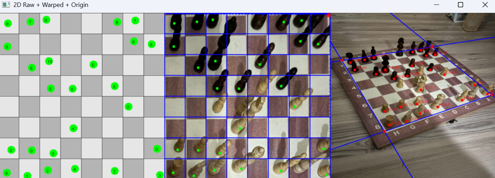

# Chessboard Vision – YOLO-based Chess Piece Detection

## Description  
This project presents a computer vision system that automatically detects and localizes chess pieces in an image.  
It uses two YOLO models:  

- **Chessboard segmentation** – detects board corners and performs perspective transformation.  
- **Piece detection** – classifies and localizes individual pieces (white/black, all types).  

Thanks to the perspective transformation, the results are mapped onto:  

- the **original image**,  
- a **bird’s-eye view**,  
- and a **raw 2D board** (square indices + piece classes).  

## Key Features  
- Automatic board detection and division into 64 squares.  
- Chess piece detection with class labels and confidence scores.  
- Mapping detected pieces to corresponding squares.  
- Side-by-side visualization in three views:  
  - Original image,  
  - Perspective-transformed image,  
  - Clean 2D board with class indices.

## Example Output

Below is an example of the program’s output:

